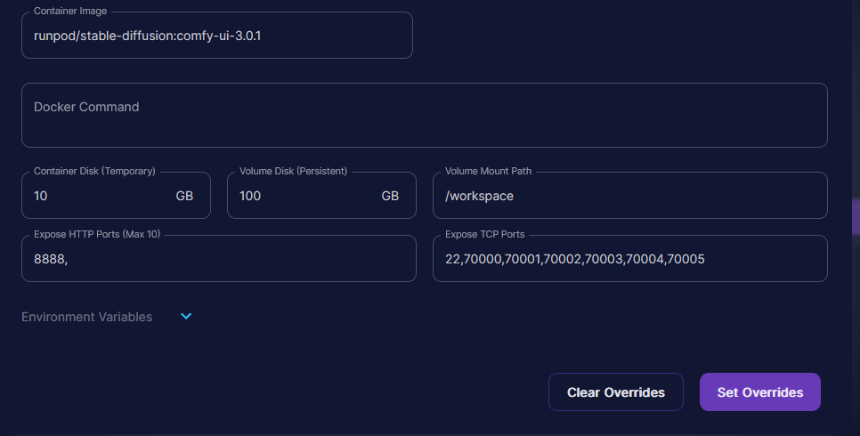
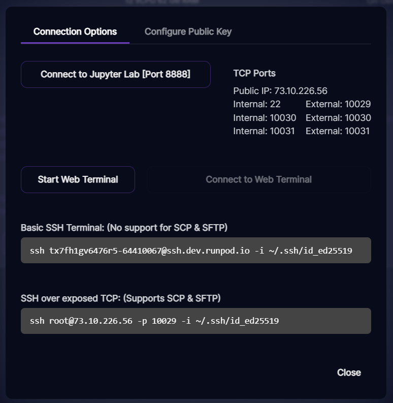
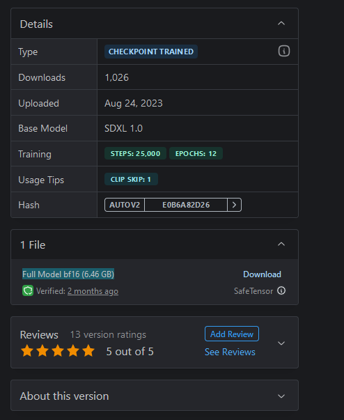

# This Document is brought to you by TaoBard,
It was been awhile since my last document, but in the efforts of evening the playing ground and allowing everybody to understand exactly what's occuring with this subnet, I have taken it upon myself to publish a set of simple instructions that almost anybody can follow to set up a txt2img miner on Runpod, as well as advice for the future of subnet documentation for those who may wish to contribute. 

## Runpod specifications
 
To begin, you **must** make sure that internal/external ports are the same, a way to do this is by setting the ports as they are here - by setting above 70000, you're telling it that the port number doesn't matter, and ensuring they will be the same. If you do not follow this first step, your miner will simply not work. 


## Installing dependencies
Everybody has their own way of doing it, but to keep it simple and brief: first, this would be if you install directly into workspace, but you can operate inside of root. If you shut your machine down, restart it, or it crashes - you're going to have to reinstall dependencies again. Either way, change your command for your directories - here's how I do it all in one command:
### ```apt update && apt upgrade -y && git clone https://github.com/unconst/ImageSubnet.git && cd /workspace/ImageSubnet && pip install -r requirements.txt && apt install nodejs npm -y && npm install -g pm2 && pip3 install bittensor```
You can instead of pip3 install bittensor, choose to gitclone the repository and install it that way, but I just do it like that. From here, you need to install your models. Go to Civit, Huggingface, or upload your own via something like gdown if you have a custom model you would like to serve to the network. First, navigate to /ComfyUI/models/checkpoints:
### ```wget -O yourmodel.safetensors yourmodeldownloadlink.com```

You'll also need a vae, the standard for XL is this command in the folder /ComfyUI/models/vae:
### ```wget -O sdxl_vae.safetensors https://civitai.com/api/download/models/166762?type=VAE&format=SafeTensor```
Alright, so what's next.. right, actually setting the ports properly, importing your wallets(it is recommend to not create them on this machine, something about exposing the coldkey), and of course - editing your workflow to accomodate the model you are utilizing. First thing we're going to do is set up out Comfy UI to be on the port, so following our example, let's put it on port number 10030. First, we navigate back to /ComfyUI, and run ps aux. This will tell you what the PID of your ComfyUI currently is, so you can shut it down. Usually, it's 27 I've found, so just run **kill 27** if it is, or change the number out for the proper PID. Next, let's restart it on the right port with PM2.
### ```pm2 start "python main.py --listen --port 10030" --name ComfyUI```
Okay good, if you've done everything right, Comfy is now running! Now if you have created your coldkey/hotkeys on another machine - which is what you should do - we are going to import them to the machine. Three commands will be needed, and you will need your mmnemoic and passwords. You can choose to keep their names as default on this machine, but if you choose to change them, make sure you either add a flag when you launch the miner that points to them, or change it in the **config.py** file. 
### `btcli w regen_coldkey` - Regen coldkey, set password
### `btcli w update` - Secure coldkey 
### `btcli w regen_hotkey` - Put registered hotkey on machine
Alright. Almost there, now you would modify your config file, as well as modify the two files within workflow to customize what your base workflow is. Custom workflows can be integrated, and you will have to modify the generate.py file in order to accomdate them. In ComfyUI, you can enable developer mode, and save your workflow as an API .json file - you can also integrate custom nodes this way, as long as they are installed on your machine. Once your miner is finally ready, you've registered your key, and you are ready to launch - we navigate to /workspace/ImageSubnet/miners/comfy and run this command: We will need to also set our axon port to the other port on the machine. Customize your flags as you so desire, this is just a baseline that will get you running for now. 
### `pm2 start "python miner.py --miner.model /workspace/ComfiUI/models/checkpoints/yourmodel.safetensors --axon.port 10032 --comfyui.port 10030" --name Miner`
Okay, congratulations, your miner should be online if you did everything per my instructions. Good job if you've made it, and good luck if you're mining - the competition is definitely fierce.

I would like to thank CreativeBuilds for the opportunity to contribute to this project, and I would like to thank all the validators and miners of the Bittensor network: you are all doing great work, and I have seen some amazing things come through this subnet - the future looks bright, and Bittensor has a secure future within the industry of Ai art, amongst other markets. 

